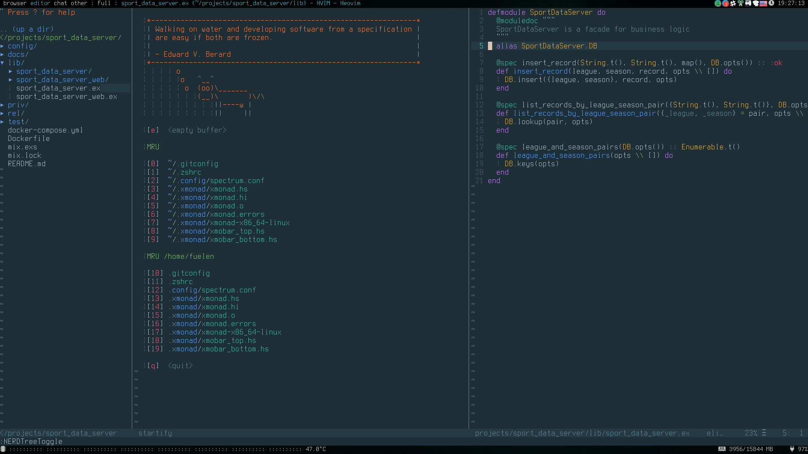

# NeoVim files

## Install on Arch linux
### packages
* neovim
* neovim-qt-git (AUR)
* python-neovim
* python2-neovim

Clone this repository into
~/.config/nvim

Run install.sh to install NeoBundle.

Run neovim-qt and install plugins (just type 'y').

Read comments in init.vim file.

## Screenshot

